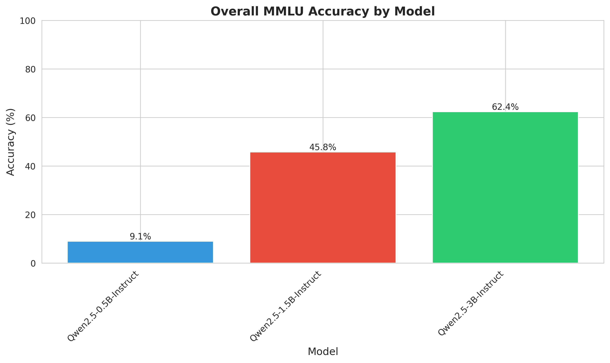
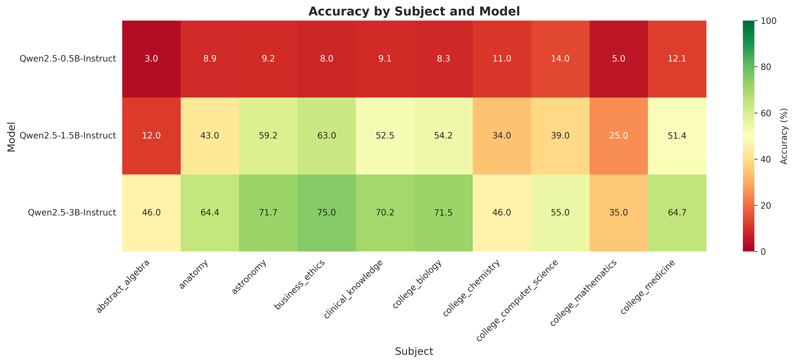
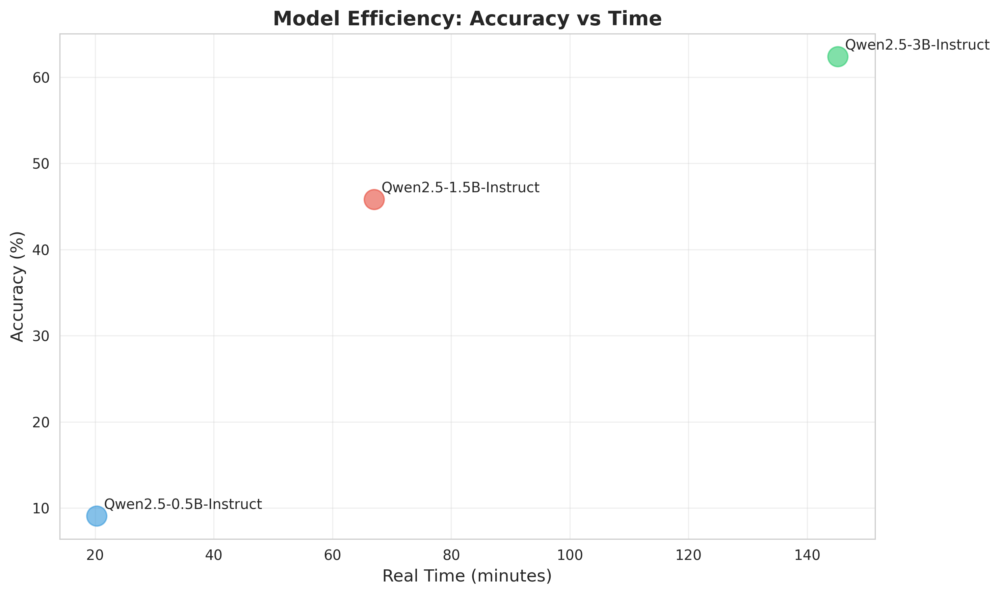
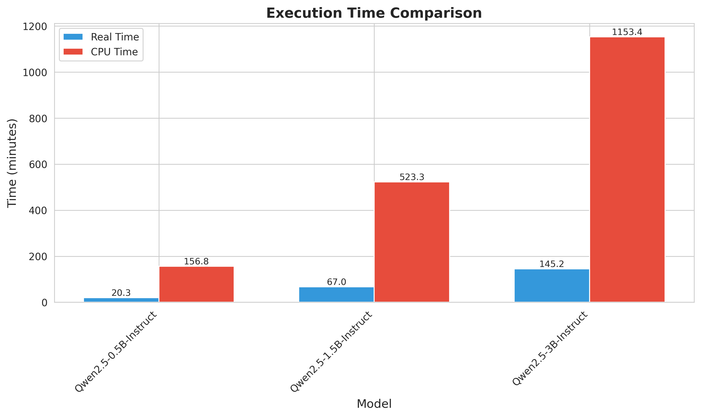

# LLM MMLU Evaluation Project

A systematic benchmark of small and medium language models on the [Massive Multitask Language Understanding (MMLU)](https://arxiv.org/abs/2009.03300) dataset, exploring the effect of model size, quantization, and hardware configuration on accuracy and inference speed.

---

## Table of Contents

1. [Setup](#1-setup)
2. [Timing Experiments — Llama 3.2-1B](#2-timing-experiments--llama-32-1b)
3. [Extended Evaluation — 10 Subjects, Multiple Models](#3-extended-evaluation--10-subjects-multiple-models)
4. [Results & Graphs — Small Models (CPU, Qwen 2.5)](#4-results--graphs--small-models-cpu-qwen-25)
5. [Results & Graphs — Medium Models (GPU, Qwen 2.5)](#5-results--graphs--medium-models-gpu-qwen-25)
6. [Error Pattern Analysis](#6-error-pattern-analysis)
7. [Google Colab Experiments](#7-google-colab-experiments)
8. [Chat Agent](#8-chat-agent)

---

## 1. Setup

### Installation

```bash
pip install transformers torch datasets accelerate tqdm huggingface_hub bitsandbytes
```

### Hugging Face Authentication

Llama 3.2-1B-Instruct is a gated model. Authentication is required before running any evaluation:

```bash
huggingface-cli login
```

Or in Python:

```python
from huggingface_hub import login
login(token="your_hf_token")
```

### Verifying the Setup

Run the baseline evaluation on 2 MMLU subjects (astronomy, business_ethics):

```bash
python llama_mmlu_eval.py
```

Expected output confirms model loads and produces results:

```
Model loaded successfully!
Model device: cpu
Model dtype: torch.float32
...
 Result: 75/152 correct = 49.34%   # astronomy
 Result: 45/100 correct = 45.00%   # business_ethics
Overall Accuracy: 47.62%
```

---

## 2. Timing Experiments — Llama 3.2-1B

The model was timed across 5 hardware/quantization configurations using the shell `time` command. All runs evaluated the same 2 subjects (252 questions total).

### Setup Configurations

| Setup | Device | Quantization | Notes |
|-------|--------|-------------|-------|
| 1 | GPU | None (FP32) | No GPU detected — fell back to CPU |
| 2 | GPU | 4-bit | Not possible (MacBook / no CUDA GPU) |
| 3 | GPU | 8-bit | Not possible (MacBook / no CUDA GPU) |
| 4 | CPU | None (FP32) | Baseline CPU run |
| 5 | CPU | 4-bit | `bitsandbytes` does not support CPU quantization — fell back to FP32 |

> **Note:** Setups 2 and 3 were skipped as the machine lacked a compatible GPU. Setup 5's 4-bit quantization was silently disabled by `bitsandbytes`, which requires a CUDA device, so it ran identically to Setup 4.

### Timing Results

All runs used `meta-llama/Llama-3.2-1B-Instruct` in FP32 on CPU (252 questions).

| Run | Timestamp | Real Time | User Time | Sys Time | Accuracy |
|-----|-----------|-----------|-----------|----------|----------|
| Setup 1 (CPU/FP32) | 20260118_224739 | 4m 00s | 28m 45s | 1m 50s | 47.62% |
| Setup 4 (CPU/FP32) | 20260118_223121 | 3m 55s | 28m 27s | 1m 21s | 47.62% |
| Setup 5 (CPU/4-bit→FP32) | 20260118_220558 | 3m 45s | 27m 49s | 0m 50s | 47.62% |
| Additional run | 20260118_214113 | 5m 03s | — | — | 47.62% |
| Additional run | 20260118_213213 | 4m 35s | — | — | 47.62% |

**Key observations:**
- Real time varied from ~3m 45s to ~5m 03s across identical runs, reflecting OS scheduling variability.
- User time (CPU computation) was consistently ~28 minutes — roughly **7–8× the real time**, indicating the model was fully parallelized across all available CPU cores.
- Accuracy was **deterministic**: all 5 runs produced exactly the same 120/252 correct answers (47.62%), confirming greedy decoding.
- 4-bit quantization on CPU provided **no benefit** because `bitsandbytes` requires CUDA. On a GPU-equipped machine, 4-bit quantization would roughly halve memory usage and typically speed up inference 1.5–2×.

---

## 3. Extended Evaluation: 10 Subjects, Multiple Models

The evaluation script was extended to:
- Run on **10 MMLU subjects** simultaneously
- Support **multiple models** in a single run
- Record **real time, CPU time, and GPU time** per model and per subject
- Support a `--verbose` flag to print each question, the model's answer, and whether it was correct

### 10 Subjects Evaluated

1. abstract_algebra
2. anatomy
3. astronomy
4. business_ethics
5. clinical_knowledge
6. college_biology
7. college_chemistry
8. college_computer_science
9. college_mathematics
10. college_medicine

### Models Evaluated

**Small models (CPU runs — Qwen 2.5 family):**

| Model | Parameters | Quantization | Device |
|-------|-----------|-------------|--------|
| Qwen/Qwen2.5-0.5B-Instruct | 0.5B | None | CPU |
| Qwen/Qwen2.5-1.5B-Instruct | 1.5B | None | CPU |
| Qwen/Qwen2.5-3B-Instruct | 3B | None | CPU |

**Medium models (Google Colab GPU runs):**

| Model | Parameters | Quantization | Device |
|-------|-----------|-------------|--------|
| Qwen/Qwen2.5-7B-Instruct | 7B | 4-bit | CUDA |
| Qwen/Qwen2.5-14B-Instruct | 14B | 4-bit | CUDA |

---

## 4. Results & Graphs — Small Models (CPU, Qwen 2.5)

### Overall Accuracy



| Model | Correct | Total | Accuracy | Real Time |
|-------|---------|-------|----------|-----------|
| Qwen2.5-0.5B-Instruct | 124 | 1369 | **9.1%** | 20.3 min |
| Qwen2.5-1.5B-Instruct | 627 | 1369 | **45.8%** | 67.0 min |
| Qwen2.5-3B-Instruct | 854 | 1369 | **62.4%** | 145.2 min |

Accuracy scales strongly with parameter count — the 3B model achieves 6.9× the accuracy of the 0.5B model while taking only 7× longer to run.

### Per-Subject Accuracy Heatmap



| Subject | 0.5B | 1.5B | 3B |
|---------|------|------|----|
| abstract_algebra | 3.0% | 12.0% | 46.0% |
| anatomy | 8.9% | 43.0% | 64.4% |
| astronomy | 9.2% | 59.2% | 71.7% |
| business_ethics | 8.0% | 63.0% | 75.0% |
| clinical_knowledge | 9.1% | 52.5% | 70.2% |
| college_biology | 8.3% | 54.2% | 71.5% |
| college_chemistry | 11.0% | 34.0% | 46.0% |
| college_computer_science | 14.0% | 39.0% | 55.0% |
| college_mathematics | 5.0% | 25.0% | 35.0% |
| college_medicine | 12.1% | 51.4% | 64.7% |

### Efficiency: Accuracy vs. Time



### Execution Time Comparison



CPU time was approximately **8× real time** for all models, confirming heavy multi-core parallelism. The 3B model consumed ~1,153 CPU-minutes for the full 10-subject evaluation.

---

## 5. Results & Graphs — Medium Models (GPU, Qwen 2.5)

Run on Google Colab with a CUDA GPU using 4-bit quantization.

### Overall Accuracy

| Model | Correct | Total | Accuracy | GPU Time |
|-------|---------|-------|----------|----------|
| Qwen2.5-7B-Instruct (4-bit) | 821 | 1369 | **60.0%** | 328 s |
| Qwen2.5-14B-Instruct (4-bit) | 1011 | 1369 | **73.8%** | 660 s |

### Per-Subject Accuracy

| Subject | 7B (4-bit) | 14B (4-bit) |
|---------|------------|-------------|
| abstract_algebra | 35.0% | 55.0% |
| anatomy | 62.2% | 73.3% |
| astronomy | 75.0% | 88.8% |
| business_ethics | 72.0% | 77.0% |
| clinical_knowledge | 73.2% | 81.9% |
| college_biology | 78.5% | 86.8% |
| college_chemistry | 34.0% | 50.0% |
| college_computer_science | 49.0% | 63.0% |
| college_mathematics | 20.0% | 54.0% |
| college_medicine | 61.3% | 78.6% |

### GPU vs. CPU Speed Comparison

The GPU speedup is dramatic. For a comparable model size (~3B CPU vs 7B GPU-4bit):

| Configuration | Model | Real Time (1369 Qs) |
|--------------|-------|---------------------|
| CPU, FP32 | Qwen2.5-3B | ~145 min |
| GPU, 4-bit | Qwen2.5-7B | ~5.6 min |

**GPU is ~26× faster** in real time, even on a larger model.

---

## 6. Error Pattern Analysis

### Are mistakes random, or systematic?

Analyzing the subject-level results reveals clear **systematic patterns**, not random noise:

**Hardest subjects (consistent across all models):**
- `college_mathematics` — lowest accuracy at every model size (5% → 25% → 35% → 20% → 54%)
- `abstract_algebra` — second hardest (3% → 12% → 46% → 35% → 55%)
- `college_chemistry` — consistently below average (11% → 34% → 46% → 34% → 50%)

**Easiest subjects:**
- `business_ethics` — highest or near-highest at every scale
- `astronomy` — strong performance even at small sizes
- `college_biology` — reliably high for 3B+ models

**Do all models make mistakes on the same questions?**

Yes, largely. The rank ordering of subjects by difficulty is **very consistent** across model sizes. A question hard for the 1.5B model is typically hard for the 3B model too. This suggests the difficulty is intrinsic to the question (requiring deep mathematical reasoning vs. factual recall) rather than being an artifact of any particular model's training.

The main exception is the jump from 0.5B to 1.5B: the 0.5B model appears to answer near-randomly (~10% ≈ chance for 4-choice MCQ), while the 1.5B model demonstrates genuine subject knowledge. At 0.5B the model likely lacks enough capacity to reliably parse the question format.

---

## 7. Google Colab Experiments

Google Colab provided a free CUDA GPU (typically T4 or A100), enabling 4-bit quantization via `bitsandbytes` and dramatically faster inference.

### Steps to Reproduce on Colab

1. Open a new Colab notebook and enable GPU runtime: **Runtime → Change runtime type → T4 GPU**
2. Install dependencies:
   ```bash
   !pip install transformers torch datasets accelerate tqdm huggingface_hub bitsandbytes
   ```
3. Authenticate with Hugging Face:
   ```python
   from huggingface_hub import login
   login(token="your_hf_token")
   ```
4. Upload `task5.py` (or your modified evaluation script) and run:
   ```bash
   !python task5.py
   ```

### Colab vs. Laptop Comparison

| Aspect | Laptop (CPU) | Google Colab (GPU) |
|--------|-------------|-------------------|
| Hardware | Multi-core CPU | NVIDIA T4 / A100 |
| Quantization | FP32 only (bitsandbytes requires CUDA) | 4-bit via bitsandbytes |
| Speed (1369 Qs, ~7B model) | ~145 min (3B FP32) | ~5.6 min (7B 4-bit) |
| Max practical model size | ~3B (memory limited) | 14B+ with 4-bit |
| Gemini integration | N/A | Built-in coding assistant in sidebar |

**Colab Gemini assistant:** Colab has a built-in Gemini coding assistant (accessible via the sparkle icon in the left sidebar). It can explain error messages, suggest code fixes, and help debug CUDA/quantization issues inline — useful for rapid iteration.

---

## 8. Chat Agent

A custom chat agent was built using Llama 3.2-1B-Instruct, implemented from scratch to understand the internals.

### Architecture

The agent maintains a `messages` list representing the conversation history and passes it to the model on every turn:

```python
messages = [{"role": "system", "content": "You are a helpful assistant."}]

while True:
    user_input = input("You: ")
    messages.append({"role": "user", "content": user_input})
    
    response = generate(messages)  # calls model with full history
    
    messages.append({"role": "assistant", "content": response})
    print(f"Assistant: {response}")
```

### Context Management

The naive implementation lets the history grow without limit, eventually exceeding the model's context window (~128k tokens for Llama 3.2, but much smaller in practice due to memory constraints). Three strategies were implemented and compared:

| Strategy | Description | Implemented in |
|----------|-------------|----------------|
| **Sliding window** | Keep only the last N turns | `results-slidingwindow.docx` |
| **Token budget** | Truncate history once total tokens exceed a threshold | `results-tokenBudget-historyon.docx` |
| **Pickle/serialize** | Save and restore conversation state between sessions | `results-pickle.docx` |

### History On vs. History Off

Disabling history (sending only the current user message each turn) produced a noticeable degradation in multi-turn coherence:

| | History ON | History OFF |
|---|-----------|------------|
| Remembers earlier context |  Yes |  No |
| Can answer follow-up questions |  Yes |  Treats each as new |
| Token usage grows |  Yes (managed) |  N/A (flat) |
| Useful for independent queries | Overkill |  Faster |

**Example of degradation without history:**

```
You: My name is Alice.
Assistant: Hello Alice!

You: What is my name?
Assistant: I don't know your name — you haven't told me yet.
```

With history maintained, the second answer correctly returns "Alice."

---

## File Reference

| File | Description |
|------|-------------|
| `llama_mmlu_eval.py` | Baseline 2-subject evaluation script |
| `task5.py` | Extended multi-model, 10-subject evaluation with timing |
| `task7.ipynb` | Google Colab notebook for medium-model evaluation |
| `task8.ipynb` | Chat agent implementation |
| `setup_1_gpu_no_quant.txt` | Timing log — Setup 1 (CPU fallback, no quant) |
| `setup_4_cpu_no_quant.txt` | Timing log — Setup 4 (CPU, no quant) |
| `setup_5_cpu_4_quant.txt` | Timing log — Setup 5 (CPU, 4-bit → fell back to FP32) |
| `llama_3.2_1b_mmlu_results_full_*.json` | Per-run results for Llama 3.2-1B (5 runs) |
| `qwen25_mmlu_results_full_20260119_041925.json` | Full results for small Qwen 2.5 models (CPU) |
| `medium_models_mmlu_results_20260119_205040.json` | Full results for medium Qwen 2.5 models (GPU) |
| `results-slidingwindow.docx` | Chat agent results — sliding window context |
| `results-tokenBudget-historyon.docx` | Chat agent results — token budget context |
| `results-pickle.docx` | Chat agent results — serialized context |
