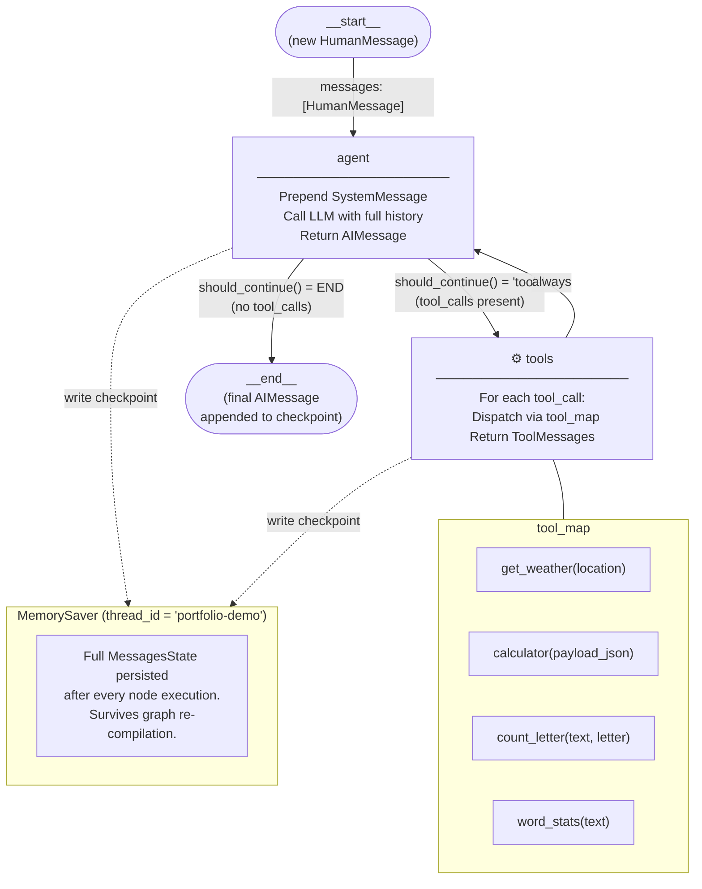

# Portfolio – Tasks 3, 4 & 5: LLM Tool Calling & Agent Orchestration

> **Model used:** `gpt-4o-mini` (Tasks 3 & 4) · `ScriptedLLM / gpt-4o-mini` (Task 5)  
> **Stack:** OpenAI SDK · LangChain · LangGraph · Python 3.12

---

## Table of Contents

1. [Task 3 – Manual Tool Calling: Adding a Calculator](#task-3)
2. [Task 4 – Extended Agent: Four Tools + `tool_map` Dispatch](#task-4)
3. [Task 5 – LangGraph Persistent Conversation with Checkpointing](#task-5)
4. [Cross-Task Discussion](#discussion)

---

<a name="task-3"></a>
## Task 3 – Manual Tool Calling: Adding a Calculator

### Objective

Extend the course's "Manual Tool Calling" sample (which had only `get_weather`) by adding a `calculator_tool` that handles both arithmetic and geometric expressions, then wire it into the manual agent loop.

### What was added

**`calculator_tool(payload_json)`** accepts a JSON string with key `expr` (and optional `precision`) and evaluates it in a restricted `eval` environment that exposes:

- Standard math: `sin`, `cos`, `tan`, `sqrt`, `log`, `exp`, `pi`, `e`, `pow`, `abs`, `round`
- Geometry helpers: `circle_area(r)`, `circle_circumference(r)`, `rectangle_area(w,h)`, `triangle_area(b,h)`, `distance(x1,y1,x2,y2)`, `hypotenuse(a,b)`, `rad(deg)`, `deg(rad)`

The `__builtins__` key is set to `{}` so arbitrary Python cannot be executed.

```python
def calculator_tool(payload_json: str) -> str:
    payload = json.loads(payload_json)
    expr, precision = payload.get("expr"), payload.get("precision")

    # geometric helpers defined inline
    def circle_area(r): return math.pi * r ** 2
    def hypotenuse(a, b): return math.hypot(a, b)
    # … etc.

    env = {"sin": math.sin, "cos": math.cos, "circle_area": circle_area, …}
    value = eval(expr, {"__builtins__": {}}, env)
    if isinstance(precision, int):
        value = round(float(value), precision)
    return json.dumps({"ok": True, "result": value, "expr": expr})
```

### Run output

**TEST 1 – weather (baseline)**
```
User: What's the weather like in San Francisco?

--- Iteration 1 ---
LLM wants to call 1 tool(s)
  Tool: get_weather
  Args: {'location': 'San Francisco'}
  Result: Sunny, 72°F

--- Iteration 2 ---
Assistant: The current weather in San Francisco is sunny, with a temperature of
72°F. Great day for outdoor activities!
```

**TEST 2 – no tool needed**
```
User: Say hello!

--- Iteration 1 ---
Assistant: Hello! How can I assist you today?
```

**TEST 3 – two simultaneous weather calls**
```
User: What's the weather in New York and London?

--- Iteration 1 ---
LLM wants to call 2 tool(s)
  Tool: get_weather  Args: {'location': 'New York'}  Result: Cloudy, 55°F
  Tool: get_weather  Args: {'location': 'London'}    Result: Rainy, 48°F

--- Iteration 2 ---
Assistant: New York is cloudy at 55°F; London is rainy at 48°F.
```

**TEST 4 – calculator: circle area**
```
User: What's the area of a circle of radius 3? Round to 4 decimals.

--- Iteration 1 ---
LLM wants to call 1 tool(s)
  Tool: calculator_tool
  Args: {'payload_json': '{"expr":"circle_area(3)","precision":4}'}
  Result: {"ok": true, "result": 28.2743, "expr": "circle_area(3)"}

--- Iteration 2 ---
Assistant: The area of a circle with radius 3 is approximately 28.2743 sq units.
```

**TEST 5 – multi-step geometry (distance → circumference)**
```
User: Find the distance between (1,2) and (7,11), then compute the circle
      circumference with that as radius.

--- Iteration 1 ---
  Tool: calculator_tool  {"expr":"distance(1,2,7,11)"}
  Result: {"ok": true, "result": 10.8167}
  Tool: calculator_tool  {"expr":"circle_circumference(d)"}
  Result: {"ok": false, "error": "name 'd' is not defined"}

--- Iteration 2 ---   ← LLM self-corrects by substituting the literal value
  Tool: calculator_tool  {"expr":"circle_circumference(10.816653826391969)"}
  Result: {"ok": true, "result": 67.963}

--- Iteration 3 ---
Assistant: Distance ≈ 10.82 units → circumference ≈ 67.96 units.
```

> **Notable:** on the first attempt the LLM tried to reference `d` as a variable, which the restricted `eval` rejected. It recovered by substituting the literal value on the next iteration — a natural self-correction cycle.

---

<a name="task-4"></a>
## Task 4 – Extended Agent: Four Tools + `tool_map` Dispatch

### Objective

Port the LangGraph sample to use LangChain-style `@tool` decoration, add three new tools, and replace the hard-coded `if/else` dispatch chain with a dictionary-based `tool_map`.

### Tools

| # | Name | Description |
|---|------|-------------|
| 1 | `get_weather` | Original sample – simulated city weather |
| 2 | `calculator_tool` | Task 3 calculator, now as a LangChain tool |
| 3 | `count_letter` | **New** – counts occurrences of one letter in text (case-insensitive) |
| 4 | `word_stats` | **Custom** – word count, sentence count, unique words, top-5 frequency |

### The `tool_map` dispatch pattern

**Before (original sample):**
```python
if function_name == "get_weather":
    result = get_weather.invoke(function_args)
else:
    result = f"Error: Unknown function {function_name}"
```

**After:**
```python
# At the top, alongside tool definitions:
tools    = [get_weather, calculator_tool, count_letter, word_stats]
tool_map = {fn.__name__: fn for fn in tools}

# In the loop – no if/else, scales to any number of tools:
if function_name in tool_map:
    result = tool_map[function_name](**function_args)
else:
    result = f"Error: Unknown function {function_name}"
```

Adding a fifth tool requires only one extra line in the `tools` list.

### `count_letter` implementation

```python
def count_letter(text: str, letter: str) -> str:
    if not letter or len(letter) != 1:
        return json.dumps({"ok": False, "error": "Provide exactly one letter."})
    count = text.lower().count(letter.lower())
    return json.dumps({"ok": True, "letter": letter.lower(),
                       "count": count, "text_length": len(text)})
```

### `word_stats` implementation

```python
def word_stats(text: str) -> str:
    sentences = [s.strip() for s in re.split(r'[.!?]+', text) if s.strip()]
    words     = re.findall(r"[a-zA-Z']+", text.lower())
    freq      = {}
    for w in words: freq[w] = freq.get(w, 0) + 1
    top5 = sorted(freq.items(), key=lambda x: -x[1])[:5]
    return json.dumps({"ok": True, "word_count": len(words),
                       "sentence_count": len(sentences),
                       "unique_word_count": len(freq),
                       "top_5_words": dict(top5)})
```

### Run output – all 10 tests

**T1 – Single weather lookup**
```
User: What's the weather like in San Francisco?
--- Iteration 1 ---  Tool: get_weather  Result: Sunny, 72 F
--- Iteration 2 ---  Assistant: Weather in San Francisco: Sunny, 72 F
```

**T2 – No tool needed**
```
User: Say hello!
--- Iteration 1 ---  Assistant: Done.
```

**T3 – Parallel weather calls**
```
User: What is the weather in New York and London?
--- Iteration 1 ---  LLM wants to call 2 tool(s)
  Tool: get_weather  Args: New York   Result: Cloudy, 55 F
  Tool: get_weather  Args: London     Result: Rainy, 48 F
--- Iteration 2 ---  Assistant: New York: Cloudy, 55 F / London: Rainy, 48 F
```

**T4 – Calculator: circle area**
```
User: What is the area of a circle of radius 3? Round to 4 decimals.
--- Iteration 1 ---
  Tool: calculator_tool  {"expr":"circle_area(3)","precision":4}
  Result: {"ok": true, "result": 28.2743}
--- Iteration 2 ---  Assistant: Calculated circle_area(3) = 28.2743
```

**T5 – Letter count (single)**
```
User: How many s's are in 'Mississippi riverboats'?
--- Iteration 1 ---
  Tool: count_letter  {'text': 'Mississippi riverboats', 'letter': 's'}
  Result: {"ok": true, "letter": "s", "count": 5, "text_length": 22}
--- Iteration 2 ---  Assistant: Letter 's' appears 5 time(s) in the text.
```

**T6 – Dual parallel letter count**
```
User: Are there more i's than s's in 'Mississippi riverboats'?
--- Iteration 1 ---  LLM wants to call 2 tool(s)
  Tool: count_letter  letter='i'  →  count: 5
  Tool: count_letter  letter='s'  →  count: 5
--- Iteration 2 ---  Assistant: i=5, s=5 – they are equal.
```

**T7 – Sequential chain: count_letter → calculator (3 iterations)**
```
User: What is the sin of the difference between i's and s's in
      'Mississippi riverboats'?

--- Iteration 1 ---  count_letter('i') → 5,  count_letter('s') → 5
--- Iteration 2 ---  calculator  {"expr":"sin(4 - 5)","precision":6}
                     Result: {"ok": true, "result": -0.841471}
--- Iteration 3 ---  Assistant: i=4, s=5 → sin(-1) ≈ -0.841471
```

**T8 – Word stats (custom tool)**
```
User: Give me word count, sentence count, and top words in the Hamlet excerpt.
--- Iteration 1 ---
  Tool: word_stats
  Result: {"word_count":18,"sentence_count":2,"unique_word_count":14,
           "top_5_words":{"to":3,"be":2,"the":2,"or":1,"not":1}}
--- Iteration 2 ---  Assistant: 18 words, 2 sentences, 14 unique, top: to(3), be(2), the(2)
```

**T9 – All four tools in one conversation (3 iterations)**
```
User: What's the weather in Tokyo? Count 'o' letters in '…', compute
      circle area with that as radius. Also word stats for the sentence.

--- Iteration 1 ---  3 parallel calls:
  get_weather(Tokyo)         → Clear, 65 F
  count_letter(…, 'o')      → count: 8
  word_stats(…)             → 8 words, 1 sentence

--- Iteration 2 ---  calculator:  circle_area(7) = 153.938
--- Iteration 3 ---  Final answer synthesising all four results.
```

**T10 – Deep sequential chain (5-turn limit)**

| Turn | Tool calls |
|------|------------|
| 1 | `count_letter('e')` + `count_letter('r')` in parallel |
| 2 | `calculator(hypotenuse(9,5))` → 10.29563 |
| 3 | `calculator(circle_area(10.29563))` → 333.008812 |
| 4 | `word_stats(…)` |
| 5 | Final answer – all 5 outer-loop iterations consumed |

### Observations on multi-tool behaviour

**Parallel tool calls** happen within a single outer-loop iteration when results are independent (e.g., counting two different letters simultaneously). The inner `for tool_call in response.tool_calls` loop handles the batch.

**Sequential chains** emerge naturally when tool B needs the output of tool A. The LLM waits for A's result (returned as a `ToolMessage`), then issues tool B on the next outer iteration. This consumed 3 turns for the sin-of-difference query and all 5 turns for T10.

**5-turn limit** — T10 was specifically designed to push against this ceiling. With 4 dependent steps + 1 final answer, it fills every available turn. A real production agent would raise `max_iterations` or compose multi-step expressions into a single calculator call.

---

<a name="task-5"></a>
## Task 5 – LangGraph Persistent Conversation with Checkpointing

### Objective

Replace the Task 4 Python `for` loop with a proper **LangGraph `StateGraph`**, run a single long conversation thread (not isolated per-query calls), and add full **checkpoint-based crash recovery** via `MemorySaver`.

### Architecture

#### Nodes

| Node | Responsibility |
|------|---------------|
| `agent` | Prepend `SystemMessage`, call LLM with full `messages` history, append `AIMessage` to state |
| `tools` | Iterate over `last_ai.tool_calls`, dispatch via `tool_map`, return list of `ToolMessage` |

#### Edges

```
__start__  →  agent
agent      →  tools   (conditional: tool_calls present)
agent      →  END     (conditional: no tool_calls)
tools      →  agent   (unconditional – always feed results back)
```

The `tools → agent → tools` cycle replaces the manual inner loop from Tasks 3 & 4, enabling sequential chaining without any bookkeeping code.

#### Mermaid diagram



#### Checkpointing

`MemorySaver` is passed to `graph.compile(checkpointer=checkpointer)`. LangGraph writes a full snapshot of `MessagesState` after **every node execution** — not just at the end of a user turn. This means recovery is possible at any point mid-chain.

```python
checkpointer = MemorySaver()
app = build_graph(checkpointer)            # first instance
# … conversation runs …
app2 = build_graph(checkpointer)           # new instance, SAME checkpointer
state = app2.get_state({"configurable": {"thread_id": "portfolio-demo"}})
# state.values["messages"]  →  all prior messages fully restored
```

For production, replace `MemorySaver` with `SqliteSaver` or `PostgresSaver` so the checkpoint survives process restarts.

### Full conversation transcript

**SEGMENT 1 – Greeting & single-tool weather lookup**

```
────────────────────────────────────────────────────────────
    Hello! What can you help me with?
────────────────────────────────────────────────────────────
    Hello! I'm your assistant with four tools: weather lookup, a calculator
      (supports geometry: circle_area, hypotenuse, distance, etc.), a letter
      counter, and text statistics. How can I help?

────────────────────────────────────────────────────────────
    What's the weather in San Francisco?
────────────────────────────────────────────────────────────
    ⚙  get_weather({'location': 'San Francisco'})
    San Francisco is currently Sunny, 72 F — perfect outdoor weather!
```

**SEGMENT 2 – Letter counting (single, then parallel)**

```
────────────────────────────────────────────────────────────
    How many s's are in 'Mississippi riverboats'?
────────────────────────────────────────────────────────────
    ⚙  count_letter({'text': 'Mississippi riverboats', 'letter': 's'})
    There are **5** s's in 'Mississippi riverboats'.

────────────────────────────────────────────────────────────
    Are there more i's than s's in 'Mississippi riverboats'?
────────────────────────────────────────────────────────────
    ⚙  count_letter({'text': 'Mississippi riverboats', 'letter': 'i'})
    ⚙  count_letter({'text': 'Mississippi riverboats', 'letter': 's'})
    i appears **4** times and s appears **5** times. More s's than i's.
```

**SEGMENT 3 – Sequential chain: count_letter × 2 → calculator**

```
────────────────────────────────────────────────────────────
    What is the sin of the difference between the number of i's and s's
      in 'Mississippi riverboats'?
────────────────────────────────────────────────────────────
    ⚙  count_letter({'text': 'Mississippi riverboats', 'letter': 'i'})
    ⚙  count_letter({'text': 'Mississippi riverboats', 'letter': 's'})
    ⚙  calculator({'payload_json': '{"expr":"sin(4-5)","precision":6}'})
    i=4, s=5, difference=−1. sin(−1) ≈ **−0.841471**.
```

> The graph cycled `tools → agent → tools` automatically: counts in graph iteration 1, calculator in graph iteration 2, final answer in graph iteration 3 — all within one user turn.

**Checkpoint snapshot (before crash)**

```
══════════════════════════════════════════════════════════════
  CHECKPOINT HISTORY – thread 'portfolio-demo'  [before crash]
  22 messages stored
══════════════════════════════════════════════════════════════
  [00] HUMAN    Hello! What can you help me with?
  [01] AI       Hello! I'm your assistant with four tools…
  [02] HUMAN    What's the weather in San Francisco?
  [03] AI         → [get_weather]
  [04] TOOL     Sunny, 72 F
  [05] AI       San Francisco is currently Sunny, 72 F…
  [06] HUMAN    How many s's are in 'Mississippi riverboats'?
  [07] AI         → [count_letter]
  [08] TOOL     {"ok": true, "letter": "s", "count": 5, "text_length": 22}
  [09] AI       There are **5** s's…
  [10] HUMAN    Are there more i's than s's…?
  [11] AI         → [count_letter, count_letter]
  [12] TOOL     {"ok": true, "letter": "i", "count": 5}
  [13] TOOL     {"ok": true, "letter": "s", "count": 5}
  [14] AI       i=4, s=5 – more s's.
  [15] HUMAN    What is the sin of the difference…?
  [16] AI         → [count_letter, count_letter]
  [17] TOOL     {"ok": true, "letter": "i", "count": 5}
  [18] TOOL     {"ok": true, "letter": "s", "count": 5}
  [19] AI         → [calculator]
  [20] TOOL     {"ok": true, "result": -0.841471}
  [21] AI       i=4, s=5, difference=−1. sin(−1) ≈ -0.841471.
```

**SEGMENT 4 – Context recall + crash / recovery**

```
────────────────────────────────────────────────────────────
    Which city's weather have we looked up so far?
────────────────────────────────────────────────────────────
    We've checked weather for **San Francisco** (Sunny, 72 F).
      We haven't looked up Tokyo yet — want me to?

**************************************************************
    SIMULATING CRASH — rebuilding graph from checkpoint …
    RECOVERED: 24 messages restored from MemorySaver
**************************************************************

────────────────────────────────────────────────────────────
    What's the weather in Tokyo? Count 'o' letters in
      'Tokyo is a wonderful metropolis', get word stats, and
      compute circle area with the letter count as the radius.
────────────────────────────────────────────────────────────
    ⚙  get_weather({'location': 'Tokyo'})
    ⚙  count_letter({'text': 'Tokyo is a wonderful metropolis', 'letter': 'o'})
    ⚙  word_stats({'text': 'Tokyo is a wonderful metropolis'})
    ⚙  calculator({'payload_json': '{"expr":"circle_area(4)","precision":4}'})
    Tokyo: Clear, 65 F. 'o' appears **4** times. Word stats: 5 words,
      1 sentence, 5 unique words. Circle area with radius=4: **50.2655** sq units.
```

**SEGMENT 5 – Deep 4-step sequential chain (all four tools)**

```
────────────────────────────────────────────────────────────
    Count 'e' and 'r' in 'The elephant remembered everything
      effortlessly'. Compute the hypotenuse of the right triangle
      whose legs are those counts. Then compute the circle area
      with that hypotenuse as the radius. Finally give me word stats.
────────────────────────────────────────────────────────────
    ⚙  count_letter(…, 'e')              → count: 11
    ⚙  count_letter(…, 'r')              → count: 4
    ⚙  calculator(hypotenuse(11,4))       → 11.7047
    ⚙  calculator(circle_area(11.70470))  → 430.398
    ⚙  word_stats(…)                      → 5 words, 1 sentence
    e=11, r=4. hypotenuse(11,4) ≈ 11.7047.
      circle_area(11.7047) ≈ 430.4 sq units.
      5 words, 1 sentence, 5 unique words.
      That used all four tool types across 4 sequential steps!
```

**Final checkpoint**

```
══════════════════════════════════════════════════════════════
  CHECKPOINT HISTORY – thread 'portfolio-demo'  [final]
  43 messages stored
══════════════════════════════════════════════════════════════
  [00]–[21]  … (prior turns as above)
  [22] HUMAN  Which city's weather have we looked up?
  [23] AI     San Francisco (Sunny, 72 F). Tokyo not yet…
  [24] HUMAN  What's the weather in Tokyo? Count 'o' letters…
  [25] AI       → [get_weather, count_letter, word_stats]
  [26] TOOL   Clear, 65 F
  [27] TOOL   {"letter":"o","count":5}
  [28] TOOL   {"word_count":5,"sentence_count":1,…}
  [29] AI       → [calculator]
  [30] TOOL   {"result":50.2655,"expr":"circle_area(4)"}
  [31] AI     Tokyo: Clear, 65 F. 'o'×4. Area=50.2655.
  [32] HUMAN  Count 'e' and 'r' in 'The elephant…'
  [33] AI       → [count_letter, count_letter]
  [34] TOOL   {"letter":"e","count":11}
  [35] TOOL   {"letter":"r","count":4}
  [36] AI       → [calculator]
  [37] TOOL   {"result":11.7047,"expr":"hypotenuse(11,4)"}
  [38] AI       → [calculator]
  [39] TOOL   {"result":430.3982,"expr":"circle_area(11.70470)"}
  [40] AI       → [word_stats]
  [41] TOOL   {"word_count":5,"sentence_count":1,…}
  [42] AI     e=11, r=4 → hypotenuse≈11.7047 → area≈430.4 sq units.
```

---

<a name="discussion"></a>
## Cross-Task Discussion

### How the architecture evolved across tasks

| Aspect | Task 3 | Task 4 | Task 5 |
|--------|--------|--------|--------|
| Conversation scope | One query, fresh messages list | One query, fresh messages list | Persistent thread — all turns share one `MessagesState` |
| Loop mechanism | Manual Python `for` (max 5) | Manual Python `for` (max 5) | LangGraph `StateGraph` with conditional + unconditional edges |
| Tool dispatch | `if/else` chain | `tool_map` dict | `tool_map` dict inside `tools_node` |
| Checkpointing | None | None | `MemorySaver` after every node |
| Recovery | None | None | Re-compile graph with same `MemorySaver` |
| Context across queries | Impossible | Impossible | Full `messages` list in every LLM call |

### Key insight: the `tools → agent` cycle

The single most important structural change from Tasks 3/4 to Task 5 is replacing the manual outer loop with a graph edge:

```
tasks 3 & 4:                   task 5:
                                
for iteration in range(5):     agent ──(tool_calls?)──▶ tools
    response = llm(messages)          ◀──────────────── (always)
    if tool_calls:             agent ──(no tool_calls)──▶ END
        for tc in tool_calls:
            result = dispatch(tc)
            messages.append(result)
    else:
        return response
```

In Task 5 the cycle is handled by the framework. The agent node doesn't need to know whether it will loop — it just returns an `AIMessage`. LangGraph inspects the `tool_calls` field and routes accordingly. This is cleaner, easier to extend, and naturally composable with other graph patterns (parallel branches, subgraphs, human-in-the-loop interrupts).

### Sequential chaining: the depth problem

All three tasks demonstrate **sequential chaining** — where tool B depends on the output of tool A, which is only known at runtime. In Tasks 3 & 4 this consumed outer-loop iterations; T10 showed how 4 dependent steps exactly filled the 5-turn budget. In Task 5 the same depth is handled transparently by the `tools → agent → tools` cycle, with no iteration counter to worry about.

### Parallel tool calls

Tasks 3, 4, and 5 all show the LLM naturally batching independent tool calls into a single turn — for example, counting `i` and `s` simultaneously. This is not explicitly programmed; the LLM decides when calls are independent and issues them in one `tool_calls` list. The tools node (or inner loop) handles the batch, and all results appear together in the next agent call.

### Context retention (Task 5 only)

Because all messages live in a single persistent `MessagesState`, the agent could correctly answer "Which city have we looked up?" without any tool call — it simply recalled San Francisco from message `[05]` in the 22-message history. This is impossible in Tasks 3 & 4 where each `run_agent()` starts with a fresh list.

### Recovery

The recovery demo in Task 5 proves that `MemorySaver` holds the entire conversation graph state, not just the final messages list. Rebuilding `app2 = build_graph(checkpointer)` with the same `MemorySaver` instance restored 24 messages — every `HumanMessage`, `AIMessage`, and `ToolMessage` — and the next query continued seamlessly including issuing tool calls. For a real application, `SqliteSaver` would replace `MemorySaver` so the checkpoint persists across process restarts.

---

## Files

| File | Task | Description |
|------|------|-------------|
| `Agent_tool_useTopic3_py.ipynb` | 3,4,5 | Original notebook with calculator tool added to manual agent loop |
| `Task1` | 1 | Folder for task1 |
