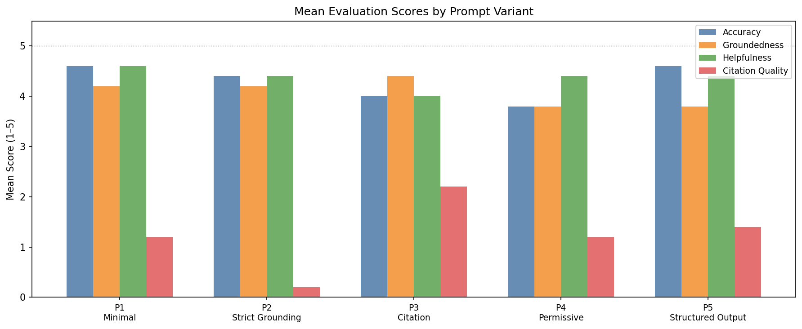
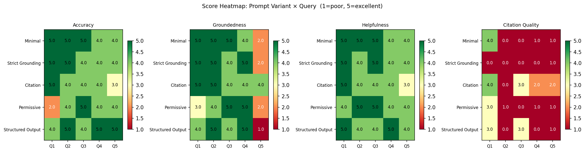

# Exercise 10: Prompt Template Variations

Testing how the **system prompt alone** — with identical retrieval and the same model — changes generation quality. The RAG pipeline (Qwen 2.5 1.5B + FAISS) is fixed across all runs. Only the instructions given to the model change.

## File Structure
```
exercise10/
├── README.md
├── Topic5_exercise10.ipynb
├── exercise10_heatmap.png
├── exercise10_scores_grouped_bar.png
├── exercise10_tradeoff.png
├── exercise10_raw_answers.csv
└── exercise10_evaluated_results.csv
```


## Setup

| Component | Details |
|---|---|
| **Corpus** | Ford Model T Service Manual (1919) |
| **LLM** | Qwen 2.5 1.5B-Instruct |
| **Embeddings** | `all-MiniLM-L6-v2` (384-dim, FAISS IndexFlatIP) |
| **Chunk size** | 512 chars, 128 overlap (fixed) |
| **Top-K** | 5 (fixed) |
| **Evaluation** | GPT-4o Mini judge — scores 1–5 on 4 dimensions |


## Prompt Variants

| ID | Name | Core instruction |
|---|---|---|
| P1 | **Minimal** | No instructions — just context + question |
| P2 | **Strict Grounding** | Answer ONLY from context; say so if absent |
| P3 | **Citation** | Quote exact passages that support each claim |
| P4 | **Permissive** | Use context but also draw on your own knowledge |
| P5 | **Structured Output** | List relevant facts first, then synthesise |


## Queries

| ID | Type | Question |
|---|---|---|
| Q1 | Narrow factual | What is the correct spark plug gap for a Model T Ford? |
| Q2 | Procedural | How do I fix a slipping transmission band? |
| Q3 | Procedural | How do I adjust the carburetor on a Model T? |
| Q4 | Broad conceptual | What oil should I use in a Model T engine? |
| Q5 | **Unanswerable** | What is the fuel efficiency of the Model T in miles per gallon? |

> Q5 is deliberately unanswerable from the corpus — it tests whether each prompt variant handles a knowledge gap gracefully or hallucinates.


## Results

### Mean Scores by Prompt Variant



> P1 (Minimal) and P5 (Structured Output) tie for the highest accuracy (~4.6). Citation quality is universally low across all variants — the model rarely cited sources unless explicitly instructed (P3), and even then only reached a mean of ~2.2.

---

### Score Heatmap — Prompt Variant × Query



> The Q5 (unanswerable) column exposes the most interesting behaviour: groundedness drops to 2.0 for Minimal, Strict Grounding, and Permissive on that query, while Citation and Structured Output handled it better. P2 (Strict Grounding) has near-zero citation scores across the board — it grounds answers well but produces no references.


## Documentation Questions

### 1. Which prompt produces the most accurate answers?

**P1 (Minimal) and P5 (Structured Output) tie at ~4.6 mean accuracy**, making them the most accurate overall.

Looking at the heatmap, P1 scores 5.0 on Q1, Q2, and Q3 — the three questions with clear answers in the manual — and drops only slightly to 4.0 on Q4 and Q5. P5 shows a different pattern: it scores 5.0 on Q2, Q4, and Q5, and is the only variant to score 5.0 on the unanswerable question, which likely reflects the structured format forcing the model to list available facts and then explicitly note what is missing rather than guessing.

**P4 (Permissive)** is the least accurate at ~3.8, and the heatmap shows why: it scored only 2.0 on Q1 (the narrow factual question about spark plug gap). When given permission to draw on general knowledge, the model appears to have defaulted to a generic answer rather than using the manual's specific measurement.

---

### 2. Which prompt produces the most useful answers?

**P1 (Minimal) leads on helpfulness at ~4.6**, followed closely by P2, P4, and P5 at ~4.4.

This is the most counter-intuitive result. The prompt with *no instructions at all* tied for the highest helpfulness score. The model apparently produces naturally helpful responses from context alone, and adding constraints (P2, P3) or structure (P5) does not meaningfully improve — and sometimes reduces — perceived usefulness.

**P3 (Citation)** had the lowest helpfulness at ~4.0. The citation requirement appears to constrain the model's ability to synthesise freely, producing answers that are more fragmented — a quote followed by explanation — rather than flowing prose that directly addresses the question.

**P5 (Structured Output)** is notable for achieving both high accuracy (4.6) and high helpfulness (4.4) simultaneously, making it the best overall variant when both dimensions matter.

---

### 3. Is there a trade-off between strict grounding and helpfulness?

**Yes, but it is weaker than expected.**

From the grouped bar chart, P2 (Strict Grounding) and P4 (Permissive) show the clearest contrast:

| Variant | Groundedness | Helpfulness |
|---|---|---|
| P2 Strict Grounding | 4.2 | 4.4 |
| P4 Permissive | 3.8 | 4.4 |

P4 trades groundedness for helpfulness as expected — lower groundedness (3.8 vs 4.2) at the same helpfulness level. However, the gap is narrow, not dramatic. The larger trade-off is visible on the **unanswerable query (Q5)**:

- P2 groundedness on Q5 = **2.0** — when strictly instructed to only use context, the model still failed to stay grounded on the one question where there was no answer to find
- P4 groundedness on Q5 = **2.0** — identical failure despite being given permission to use general knowledge

This means neither strict nor permissive instructions reliably prevent groundedness failures when the corpus simply does not contain the answer. The variant that handled Q5 best on groundedness was **P3 (Citation) at 4.0** — being forced to quote a source apparently made the model more aware of when no quotable source existed, leading it to flag the absence rather than invent content.

**The practical conclusion:** strict grounding improves reliability on answerable questions but does not protect against hallucination on unanswerable ones. Structured Output (P5) comes closest to achieving both high accuracy and high groundedness without sacrificing helpfulness.

---

## Key Findings Summary

| Prompt | Best at | Weakness |
|---|---|---|
| P1 Minimal | Accuracy, Helpfulness | Citation quality near zero |
| P2 Strict Grounding | Groundedness on in-corpus questions | Fails on unanswerable Q5; zero citation |
| P3 Citation | Citation quality (highest at 2.2); handles unanswerable Q5 best on groundedness | Lower accuracy and helpfulness |
| P4 Permissive | Helpfulness tied with others | Lowest accuracy (Q1 scored 2.0); lowest groundedness |
| P5 Structured Output | Balanced accuracy + helpfulness; best on Q5 accuracy | Low groundedness on Q5; low citation |

---

## Conclusion

The most surprising finding is that **adding instructions does not reliably improve accuracy or helpfulness** — the minimal prompt matched or outperformed most structured variants on both dimensions. Instructions matter most for two specific use cases: when you need citations (use P3, accepting a helpfulness trade-off) or when answers need to be scannable and structured (use P5).

The trade-off between strict grounding and helpfulness exists but is narrower than expected. The real differentiator is how each prompt handles **questions the corpus cannot answer**. Citation (P3) performs best here because forcing the model to quote forces it to confront the absence of quotable material. This suggests that for RAG systems deployed on incomplete corpora, a citation or evidence-first prompt is more robust than a simple "only use the context" instruction.

**Recommended prompt for general use:** P5 (Structured Output) — it achieves the best balance of accuracy (4.6), helpfulness (4.4), and structured readability, while its fact-listing step makes knowledge gaps visible rather than hidden.


