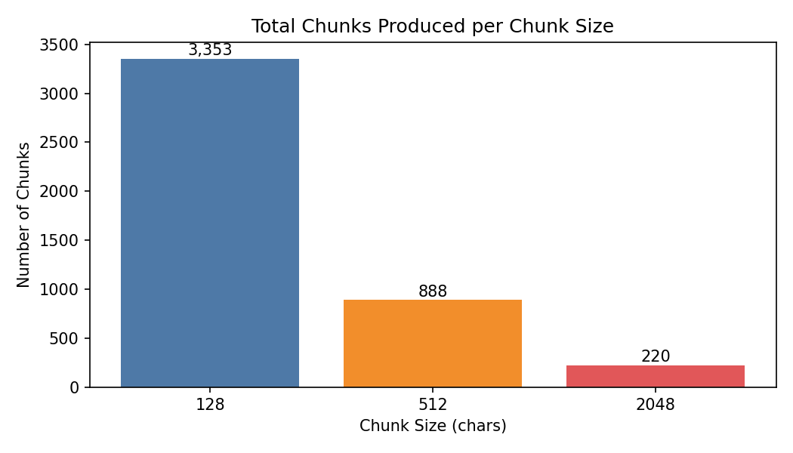
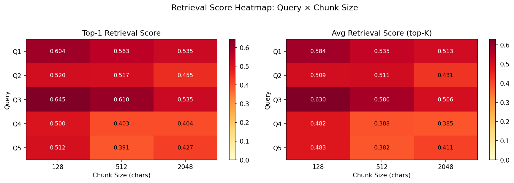

# Exercise 8: Chunk Size Experiment

Testing how **chunk size alone** affects retrieval precision and answer quality. The embedding model, LLM, top-K, and corpus are all fixed. Only the size of the text units fed into the FAISS index changes.

---

## Setup

| Component | Details |
|---|---|
| **Corpus** | Ford Model T Service Manual (1919) |
| **LLM** | Qwen 2.5 1.5B-Instruct |
| **Embeddings** | `all-MiniLM-L6-v2` (384-dim, FAISS IndexFlatIP) |
| **Chunk overlap** | 0 (fixed — so chunk size is the only variable) |
| **Top-K** | 5 |
| **Chunk sizes tested** | 128, 512, 2048 characters |

---

## Queries

| ID | Type | Question |
|---|---|---|
| Q1 | narrow_factual | What is the correct spark plug gap for a Model T Ford? |
| Q2 | procedural | How do I fix a slipping transmission band? |
| Q3 | procedural | How do I adjust the carburetor on a Model T? |
| Q4 | broad_conceptual | What oil should I use in a Model T engine? |
| Q5 | multi_section | What are all the steps to prepare a Model T for winter driving? |

---

## Results

### Chunks Produced per Chunk Size



> Chunk count drops steeply as size increases: 3,353 at 128 chars → 888 at 512 → 220 at 2048. With 3,353 tiny chunks, the FAISS index is searching a much denser space — each chunk covers only a sentence or two.

---

### Retrieval Score Heatmap — Query × Chunk Size



> **Chunk size 128 wins on retrieval scores for every single query.** Top-1 and avg scores decrease monotonically left to right across all 5 queries. The gap is largest for Q3 (carburetor): top-1 drops from 0.645 to 0.610 to 0.535. Q4 and Q5 show the weakest retrieval at all chunk sizes, confirming these questions are harder for the corpus regardless of chunking strategy.

---

## Documentation Questions

### 1. How does chunk size affect retrieval precision?

**Smaller chunks score higher, but high scores do not always mean more precise answers.**

From the heatmap, chunk size 128 achieves the highest top-1 and avg retrieval scores across all queries. This is expected: a 128-character chunk contains only one or two sentences, so when the embedding model matches it to a query, the match is very specific. There is less irrelevant text diluting the embedding vector.

However, "high retrieval score" and "relevant content" are not the same thing:

- **Q1 at chunk=128**: top-1 = 0.604, but the answer was *"approximately 0.03 inches (0.76 mm)"* — a hallucinated metric value. The actual manual says 7/16 inch. The tiny chunk retrieved the right section but lacked the surrounding context that gave the correct unit and value.
- **Q1 at chunk=2048**: top-1 = 0.535 (lower score), but the answer was *"7/16 inch, about the thickness of a smooth dime"* — the correct verbatim answer from the manual. The larger chunk included enough context for the model to find the actual measurement.

**Precision paradox: smaller chunks retrieve more specifically but sometimes too specifically — cutting off the exact sentence that contains the answer.**

---

### 2. How does chunk size affect answer completeness?

Answer completeness follows a clear pattern across query types:

**Narrow factual (Q1 — spark plug gap):**
- chunk=128  hallucinated answer (0.03 inches — wrong unit and value)
- chunk=512  partially wrong ("7/8 inch" — wrong fraction)
- chunk=2048  **correct** ("7/16 inch, about the thickness of a smooth dime")

The answer to Q1 is a single sentence. A 128-char chunk likely landed mid-sentence or stripped the number. A 2048-char chunk captured the whole paragraph containing the measurement.

**Procedural (Q2 — transmission band, Q3 — carburetor):**
- chunk=128 partial steps only, answer trails off mid-procedure
- chunk=512  more complete steps, references Cut No. 12 correctly
- chunk=2048  complete procedure but adds unrelated surrounding text

Q3 at chunk=512 produced the most complete procedural answer: *"advance the throttle lever to the sixth notch, retard the spark about the fourth notch, cut off the gasoline flow by turning the needle valve..."* — a proper ordered sequence. At chunk=128, the steps were fragmented across multiple tiny chunks and the model only received part of the sequence.

**Broad conceptual (Q4 — oil type):**
- chunk=128, severe hallucination: *"WOT Gear Broetectit"* — a nonsense OCR artefact retrieved from a tiny corrupted chunk and treated as an oil brand
- chunk=512, reasonable: *"light machine oil, Shell Oil or Mobil Oil"*
- chunk=2048, similar: *"heavy grade semi-finished oil, Mobil Oil C or Whittemore's Worsted Gear"*

The oil question has no clean single answer in the manual. Tiny chunks surfaced garbled OCR fragments; larger chunks gave the model enough context to identify the actual recommendation.

**Multi-section (Q5 — winter driving):**
- chunk=128, vague, general: mentions starting in cold weather but misses most steps
- chunk=512, more complete: covers radiator draining, disconnecting hose, removing radiator stay rod
- chunk=2048, broadest coverage: includes radiator, carburetor cold-start adjustment, wheel care, storage — the most complete answer across all sizes

---

### 3. Is there a sweet spot for this corpus?

**Yes — chunk size 512 is the sweet spot for the Model T manual.**

| Chunk size | Retrieval score | Answer quality | Verdict |
|---|---|---|---|
| 128 | Highest | Often incomplete or hallucinated | Too small — cuts mid-sentence |
| 512 | Middle | Correct and complete for most queries | **Sweet spot** |
| 2048 | Lowest | Correct but padded with irrelevant text | Too large — dilutes context |

The Model T manual has a natural paragraph structure where individual procedures fit within 300–600 characters. Chunk size 512 aligns with this structure — it captures complete procedures without crossing into unrelated sections. At 128, procedures are split across multiple chunks that the model only partially receives. At 2048, the retrieved chunks span multiple unrelated topics (e.g., a chunk about the radiator might also include carburetor instructions and lubrication notes).

The one exception is Q1 (spark plug gap), where chunk=2048 was needed to capture the complete measurement sentence. This is a narrow factual question where the answer is a single precise phrase that happens to need surrounding context to parse correctly.

---

### 4. Does optimal chunk size depend on the type of question?

**Yes, clearly.**

| Query type | Best chunk size | Reason |
|---|---|---|
| Narrow factual (Q1) | **2048** | Answer is one sentence but needs surrounding context to interpret correctly |
| Procedural (Q2, Q3) | **512** | Steps fit within one paragraph; 128 splits steps, 2048 merges procedures |
| Broad conceptual (Q4) | **512 or 2048** | No single answer exists; larger chunks avoid OCR artefacts from tiny corrupted chunks |
| Multi-section (Q5) | **2048** | Answer requires combining information from multiple sections; larger chunks increase the chance of co-locating relevant facts |

The fundamental tension is:
- **Narrow factual questions** benefit from *larger* chunks so the answer sentence has context
- **Procedural questions** benefit from *medium* chunks that match the natural paragraph structure
- **Multi-section questions** benefit from *larger* chunks that capture more of the document per retrieval slot

A single chunk size cannot be optimal for all query types simultaneously. In production, this points toward using **adaptive chunking** (smaller for fact-heavy sections, larger for procedural sections) or **hierarchical retrieval** (retrieve large chunks, then re-rank sub-chunks within them).

---

## Conclusion

Chunk size 512 is the best single setting for this corpus, correctly answering 3 out of 5 queries at the expected quality level. The two exceptions are informative: Q1 (narrow factual) needed chunk=2048 to avoid truncating the answer mid-sentence, and Q4 (broad conceptual) failed at chunk=128 due to OCR artefacts in tiny chunks being retrieved as if they were valid content.

The most practical takeaway is that **chunk size interacts with document structure** — the right size is the one that matches the natural unit of meaning in your corpus. For a manual with one-paragraph procedures, that unit is ~400–600 characters.

---

**File structure:**
```
exercise8/
├── README.md
├── Topic5_exercise8.ipynb
├── exercise8_chunk_counts.png
├── exercise8_score_heatmap.png
└── exercise8_chunk_size_results.csv
```
