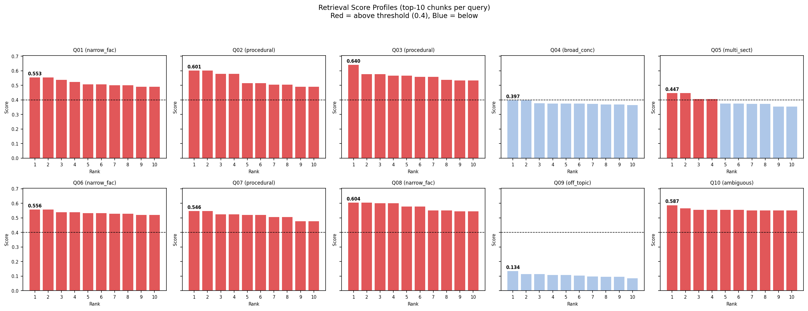
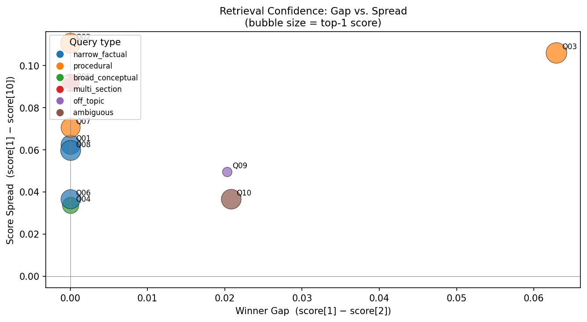
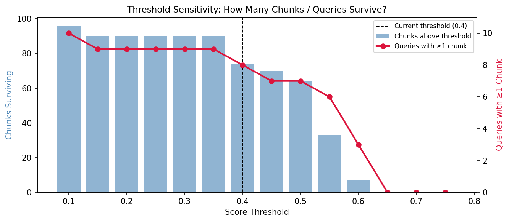

# Exercise 9: Retrieval Score Analysis

Analysing the **similarity scores returned by FAISS** across 10 queries to understand when retrieval is confident, when it is ambiguous, and what threshold separates relevant from irrelevant results.

---

## Setup

| Component | Details |
|---|---|
| **Corpus** | Ford Model T Service Manual (1919) |
| **LLM** | Qwen 2.5 1.5B-Instruct |
| **Embeddings** | `all-MiniLM-L6-v2` (384-dim, FAISS IndexFlatIP) |
| **Chunk size** | 512 chars, 128 overlap |
| **Top-K** | 10 (for score analysis) |
| **Threshold tested** | 0.4 |

---

## Queries

| ID | Type | Question |
|---|---|---|
| Q01 | narrow_factual | What is the correct spark plug gap for a Model T Ford? |
| Q02 | procedural | How do I fix a slipping transmission band? |
| Q03 | procedural | How do I adjust the carburetor on a Model T? |
| Q04 | broad_conceptual | What oil should I use in a Model T engine? |
| Q05 | multi_section | What are all the steps to prepare a Model T for winter driving? |
| Q06 | narrow_factual | How do I start a Model T Ford? |
| Q07 | procedural | How do I check and fill the radiator on a Model T? |
| Q08 | narrow_factual | What does the hand throttle lever do on a Model T? |
| Q09 | **off_topic** | What is the latest iPhone model released by Apple? |
| Q10 | ambiguous | How does the Ford engine work? |

---

## Results

### Score Profiles — Top-10 Chunks per Query



> Red bars = above threshold (0.4). Blue bars = below. Q04 and Q09 are entirely blue — the retriever found no relevant chunks for either query. Q03 is the only query with a visible drop from rank 1 to rank 2.

---

### Retrieval Confidence: Gap vs. Spread



> Q03 is the clear outlier — far right with the largest winner gap (0.063) and largest spread (0.106). All other in-corpus queries cluster near the y-axis with near-zero winner gaps. Q09 (off-topic) appears isolated with a small gap but tiny bubble, reflecting its very low top-1 score (0.134).

---

### Threshold Sensitivity



> At threshold 0.4 (dashed line): 73 chunks survive and 8 of 10 queries retain at least one chunk. The red line holds flat from 0.1 to 0.35, then drops sharply above 0.55 — above 0.65 almost no queries survive.

---

## Documentation Questions

### 1. When is there a clear "winner" (large gap between #1 and #2)?

**Q03 (carburetor adjustment) is the only query with a meaningfully large winner gap — 0.0629.**
Every other in-corpus query has a winner gap of exactly 0.0 or near-zero (Q10 = 0.0208), meaning the top-1 and top-2 chunks scored identically or near-identically.

From the gap vs. spread chart, Q03 sits far to the right while all other queries cluster on the y-axis. This makes sense: the carburetor section is a distinct, self-contained passage that the embedding model can uniquely match to the query. The retriever is confident it found the right chunk and that it is better than the next best.

**Q09 (off-topic iPhone query)** also shows a small winner gap (0.0203), but this is misleading — the gap exists because the top-1 score (0.134) is simply slightly less wrong than the top-2 score (0.114). Neither chunk is relevant; the gap here reflects noise, not signal.

---

### 2. When are scores tightly clustered (ambiguous)?

**The dominant pattern in this corpus is tight clustering — most queries have a winner gap of 0.0 and a score_std below 0.025.**

Looking at the score profiles:
- **Q01, Q06, Q08** (narrow_factual): all 10 bars are nearly identical in height, all above 0.49. The retriever is returning many equally-relevant chunks — the answer to a factual question appears in multiple places in the manual with similar wording
- **Q04** (oil type): tightly clustered at a *low* level — all 10 bars sit just below 0.4. The corpus does not contain a direct answer to this question, so the retriever retrieves marginally related chunks that all score equally poorly
- **Q10** (ambiguous — "How does the Ford engine work?"): tight cluster at high scores (0.54–0.59). The broad phrasing matches many chunks equally, making it ambiguous which passage is most relevant

The lowest score_std belongs to **Q10 (0.0108)** and **Q04 (0.0109)** — both flat for opposite reasons: Q10 because the question matches many chunks, Q04 because it matches none well.

---

### 3. What score threshold would you use to filter out irrelevant results?

**A threshold of 0.4 is the right choice for this corpus.**

Evidence from the data:

| Query | Top-1 Score | Chunks above 0.4 | Relevant? |
|---|---|---|---|
| Q09 (off-topic, iPhone) | 0.134 | **0** | Correctly filtered |
| Q04 (oil type, not in corpus) | 0.397 | **0** | Correctly filtered |
| Q05 (multi-section, partial) | 0.447 | **4** |  Partially retained |
| All others | 0.546–0.640 | **10** |  Fully retained |

At threshold 0.4:
- The off-topic query (Q09) and the unanswerable query (Q04) are **completely filtered out** — the model correctly returns "No chunks passed the score threshold" instead of hallucinating
- 8 out of 10 queries retain at least one chunk
- The threshold sensitivity chart shows this is the last value before the chunk count begins dropping significantly — it is the sweet spot between filtering noise and losing coverage

Going higher (e.g., 0.5) starts removing valid chunks from Q05 and reduces coverage to ~7 queries. Going lower (e.g., 0.3) lets all queries through including Q04 and Q09, which generates unreliable answers.

---

### 4. How does score distribution correlate with answer quality?

The CSV answers confirm the pattern clearly:

**High top-1 score + clear winner gap → best answers.**
Q03 (top-1 = 0.640, gap = 0.063) produces the most specific, step-by-step carburetor answer directly from the manual. The retriever's confidence was justified.

**High top-1 score + tight cluster → good but verbose answers.**
Q01, Q02, Q08 all have top-1 scores above 0.55 but winner_gap = 0.0. Their answers are correct but tend to repeat information across the retrieved chunks. The model gets the right answer but includes redundant detail because all 10 chunks were treated as equally authoritative.

**Low top-1 score + tight cluster → two distinct failure modes:**
- **Q04** (top-1 = 0.397): without threshold, the model still attempts an answer and produces a partially hallucinated one ("Use Mobil Oil or Whittemore's WGP gear oil") drawn from marginal chunks. With threshold applied, it correctly refuses. Score distribution predicted the failure; the threshold enforced the right behaviour.
- **Q09** (top-1 = 0.134): without threshold, the model answers from its own parametric knowledge — "As of my last update in October 2023, the latest iPhone model was the iPhone 14 series" — entirely ignoring the retrieved context. The score distribution was a perfect signal that nothing in the corpus was relevant, but the model still generated a response. The threshold is the only mechanism that prevented this.

---

## Threshold Experiment: Score > 0.4

| Query | Chunks (no threshold) | Chunks (threshold ≥ 0.4) | Effect |
|---|---|---|---|
| Q01–Q03, Q06–Q08, Q10 | 10 | 10 | No change — all chunks already above |
| Q05 (multi-section) | 10 | 4 | Reduced context; answer became more focused on winter-specific steps |
| Q04 (oil, not in corpus) | 10 | **0** | Model correctly returns "No chunks passed the score threshold" |
| Q09 (off-topic) | 10 | **0** | Model correctly returns "No chunks passed the score threshold" |

The threshold had no effect on the 7 in-corpus questions with strong retrieval scores. Its value is entirely in the two edge cases: **it prevented one hallucination (Q04) and one parametric bypass (Q09)**, both of which produced misleading answers without it.

---

## Conclusion

For this corpus, **most queries return tightly clustered scores** — the Model T manual uses consistent language throughout, so many chunks score similarly for any given question. A clear winner gap (like Q03) is the exception, not the rule, and only occurs when one passage is uniquely specific to the query.

The score threshold at **0.4** is the most actionable finding: it is the natural break point between in-corpus questions (top-1 ≥ 0.45) and out-of-corpus questions (top-1 ≤ 0.40). Implementing it costs nothing on answerable questions and prevents hallucination on unanswerable ones.

**File structure:**
```
exercise9/
├── README.md
├── Topic5_exercise9.ipynb
├── exercise9_score_profiles.png
├── exercise9_gap_vs_spread.png
├── exercise9_threshold_sensitivity.png
├── exercise9_score_details.csv
└── exercise9_score_summary.csv
```
